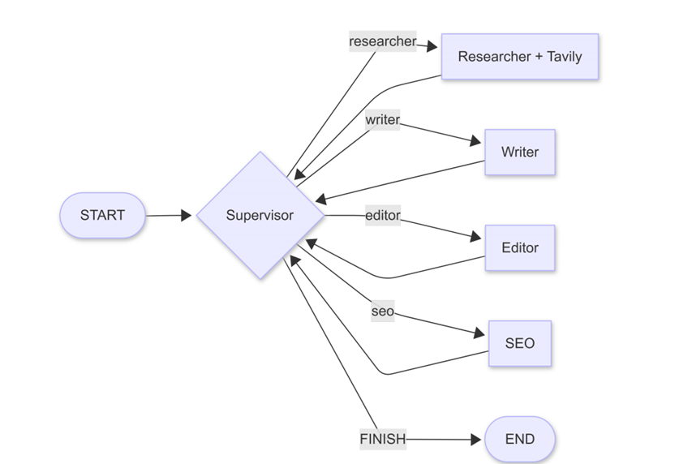
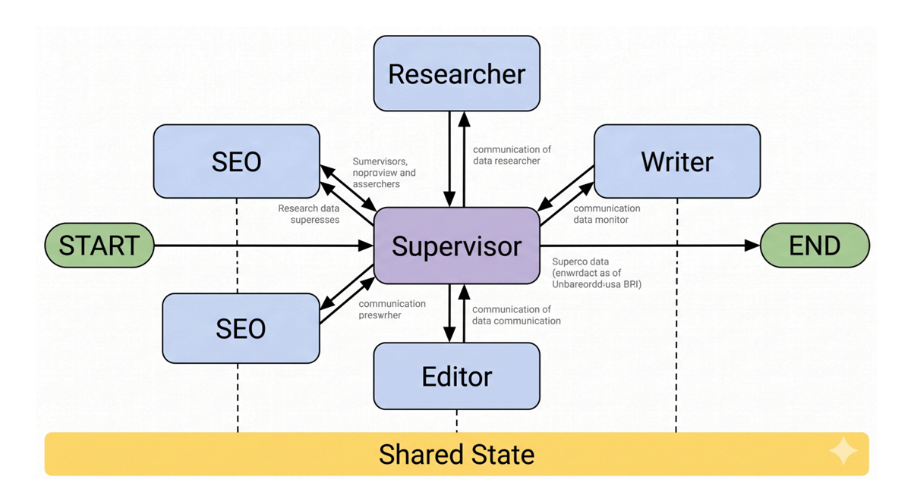

# Supervisor Content Team


A multi-agent content generation system built with LangGraph, where a supervisor LLM orchestrates four specialist agents to research, write, edit, and SEO-optimize articles end-to-end.

## Architecture

### Graph Overview



### Agent Roles



## What It Does

- Researcher: gathers web facts via Tavily and synthesizes a brief
- Writer: drafts the article from the brief
- Editor: tightens the prose and may request one revision
- SEO: generates title, meta description, keywords, and slug
- Supervisor: decides who runs next based on the current state

## Why This Design

- Clear separation of concerns (one role per agent)
- Self-correction loop (editor can send back to writer once)
- Hard step cap prevents infinite loops
- Different temperatures for routing (0.0) vs prose (0.6)
- Different models for supervisor (cheap and fast) vs workers (quality)


## Run

```bash
uv sync
cp .env.example .env  # add your GEMINI_API_KEY and TAVILY_API_KEY
uv run main.py "Your topic here"
```

## Design Q&A

### Why does the supervisor use a cheaper model than the workers?

The supervisor's only job is to pick which agent runs next.
That's classification across five labels, not writing. A small,
fast model handles that just as well as an expensive one and at
a fraction of the cost. The workers actually produce prose, so
they're where quality matters and the upgrade is worth paying for.

### Why isn't the prompt enough to guarantee termination?

A prompt can ask the model nicely to stop, but the model can
still ignore it. If you want a real guarantee that the graph
terminates, you have to enforce it in code. That's why there's
a MAX_STEPS cap inside the supervisor and a recursion_limit on
the graph stream. The prompt sets the expectation, the code
makes it stick.

### Why does the supervisor see a boolean snapshot, not the full draft?

The supervisor doesn't need to read the article to decide what
runs next. It just needs to know what's already been done. A
small status snapshot ("draft done: true, editor verdict:
revision") is enough. Sending the full draft on every turn would
burn thousands of tokens and slow each routing decision down for
no real benefit.

### Why is structured output required for routing?

The conditional edge dispatches by exact string match against
node names. If the model returns "I think we should go to the
writer next" instead of just "writer", the routing breaks.
Wrapping the supervisor call in a Pydantic Route schema forces
the output into one of the five valid labels and nothing else,
so dispatch always lands on a real destination.

### Why does history need a reducer when no other field does?

Most fields in the state get replaced when a new value comes in.
The draft from the second writer turn just overwrites the first
one. History is different. It needs to accumulate as the run
progresses, not get wiped each time. The
Annotated[list[str], operator.add] tells LangGraph to append
new entries instead of overwriting the list.

### Why does the editor put its verdict on the last line?

Parsing a fixed position is easier than trying to extract
structured data from somewhere in the middle of free text. The
last line is also trivial to strip before publishing, so
"APPROVED" or "REVISION: ..." never leaks into the article that
ships to the reader.

### What stops the editor-writer loop from running forever?

Two layers. At the prompt level, the editor is told to use
revisions sparingly, and the code only honors the first revision
request the editor sends. On top of that, there's a hard cap:
MAX_STEPS in the supervisor and recursion_limit on the graph
itself. Even if the prompt-level guard fails for any reason,
the run still stops after a known number of steps.

### Why stream the graph instead of calling .invoke() once?

Calling .invoke() runs the whole graph and gives you the final
state. That works, but you stare at a silent terminal while the
agents do their thing. Streaming yields the state after each
node, so the handoff log can print live as it happens. It's also
easier to debug, since you can see exactly which agent ran when
something looks off.